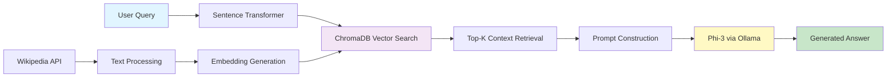

# 🧠 Offline Wikipedia RAG System

<p align="center">
  
  
  
  
  
  
</p>

<p align="center">
  <b>Privacy-First | Fully Offline | Context-Aware Question Answering</b>
</p>

---

## 📖 Overview

A production-ready **Retrieval-Augmented Generation (RAG)** system that operates **100% offline** using local LLMs. This project combines the power of Wikipedia's knowledge base with Microsoft's Phi-3 model (via Ollama) and state-of-the-art semantic search to deliver accurate, context-grounded answers without any cloud dependencies.

Perfect for privacy-sensitive applications, air-gapped environments, or anyone who wants full control over their AI infrastructure.

### 🎯 Why This Project?

- **🔒 Privacy-First**: All data and processing stay on your machine
- **⚡ Lightning Fast**: No API latency - answers in seconds
- **💰 Zero Cost**: No API fees or subscriptions required
- **🛡️ Secure**: Works in air-gapped/offline environments
- **🎓 Educational**: Learn RAG architecture hands-on

---

## ✨ Features

<table>
<tr>
<td width="50%">

### 🔍 **Semantic Search**
- Dense embedding retrieval using MPNet
- Context-aware similarity matching
- Handles complex queries effectively

### 🤖 **Local LLM Generation**
- Powered by Microsoft Phi-3 (3.8B params)
- Runs via Ollama for optimal performance
- No internet connection required

</td>
<td width="50%">

### 📚 **Wikipedia Integration**
- Dynamic article fetching
- Intelligent text chunking
- Efficient caching system

### ⚙️ **Modular Architecture**
- Swap embedding models easily
- Support for multiple LLMs
- Extensible pipeline design

</td>
</tr>
</table>

---

## 🏗️ Architecture



### 📊 System Workflow

1. **Indexing Phase**: Wikipedia articles → Text normalization → Embedding generation → ChromaDB storage
2. **Query Phase**: User question → Query embedding → Similarity search → Context retrieval
3. **Generation Phase**: Context + Query → Prompt engineering → Phi-3 inference → Natural language answer

---

## 🛠️ Technology Stack

| Component | Technology | Purpose |
|-----------|-----------|---------|
| **Embeddings** | `all-mpnet-base-v2` | Dense semantic representations (768-dim) |
| **Vector Store** | ChromaDB | Fast similarity search with HNSW indexing |
| **LLM** | Phi-3 (3.8B) | Local answer generation via Ollama |
| **Knowledge Source** | Wikipedia API | Real-time article fetching |
| **Runtime** | Python 3.10+ | Core application environment |
| **IDE** | VS Code | Development & debugging |

---

## 🚀 Quick Start

### Prerequisites

- Python 3.10 or higher
- 8GB+ RAM recommended
- 10GB free disk space (for models)

### Installation

```bash
# 1️⃣ Clone the repository
git clone https://github.com/shamilop100/Offline-Wikipedia-RAG-System-Using-Local-LLM-and-Sentence-Transformers.git
cd Offline-Wikipedia-RAG-System-Using-Local-LLM-and-Sentence-Transformers

# 2️⃣ Create virtual environment
python -m venv venv

# Activate (Windows)
venv\Scripts\activate

# Activate (Mac/Linux)
source venv/bin/activate

# 3️⃣ Install Python dependencies
pip install -r requirements.txt

# 4️⃣ Install Ollama and Phi-3
# Download from: https://ollama.ai
ollama pull phi3
```

### 🎬 Running the System

```bash
# Build the Wikipedia index
python src/build_index.py

# Run queries
python src/retrieve_and_generate.py
```

---

## 📁 Project Structure

```
rag_project/
│
├── 📂 data/                     # Local cache for downloaded content
│
├── 📂 src/
│   ├── 📄 build_index.py        # Index Wikipedia articles into ChromaDB
│   ├── 📄 retrieve_and_generate.py  # Core RAG pipeline
│   └── 📄 utils.py              # Helper functions & utilities
│
├── 📄 requirements.txt          # Python dependencies
├── 📄 .gitignore               # Git ignore rules
└── 📄 README.md                # This file
```

---

## 💻 Usage Examples

### Building the Knowledge Index

```python
# src/build_index.py
from sentence_transformers import SentenceTransformer
import chromadb
import wikipedia

def normalize_text(text):
    """Remove extra whitespace and normalize text."""
    return ' '.join(text.strip().split())

def fetch_wikipedia_articles(topics, max_chars=2000):
    """
    Fetch Wikipedia articles for given topics.
    
    Args:
        topics: List of Wikipedia page titles
        max_chars: Maximum characters to extract per article
    
    Returns:
        List of documents with title and text
    """
    docs = []
    for topic in topics:
        try:
            content = wikipedia.page(topic).content[:max_chars]
            docs.append({
                "title": topic,
                "text": normalize_text(content)
            })
            print(f"✅ Fetched: {topic}")
        except Exception as e:
            print(f"❌ Failed to fetch {topic}: {e}")
            continue
    return docs

# Initialize embedding model (768-dimensional vectors)
print("Loading embedding model...")
model = SentenceTransformer("sentence-transformers/all-mpnet-base-v2")

# Create ChromaDB collection
print("Initializing vector database...")
chroma_client = chromadb.Client()
collection = chroma_client.create_collection("wiki_collection")

# Define topics to index
topics = [
    "Artificial intelligence",
    "Machine learning",
    "Neural networks",
    "Data science",
    "Natural language processing"
]

# Fetch and index articles
print("\nFetching Wikipedia articles...")
docs = fetch_wikipedia_articles(topics)

print("\nGenerating embeddings and storing in ChromaDB...")
for i, doc in enumerate(docs):
    embedding = model.encode(doc["text"]).tolist()
    collection.add(
        ids=[str(i)],
        embeddings=[embedding],
        metadatas=[{"title": doc["title"]}],
        documents=[doc["text"]]
    )
    print(f"  Indexed: {doc['title']}")

print(f"\n🎉 Successfully indexed {len(docs)} Wikipedia articles!")
```

### Query System with RAG Pipeline

```python
# src/retrieve_and_generate.py
from sentence_transformers import SentenceTransformer
import chromadb
import subprocess
import sys

# Load embedding model and vector store
print("Loading retriever...")
retriever = SentenceTransformer("sentence-transformers/all-mpnet-base-v2")

print("Connecting to ChromaDB...")
chroma_client = chromadb.Client()
collection = chroma_client.get_collection("wiki_collection")

def query_ollama_phi3(prompt, model="phi3"):
    """
    Query Phi-3 locally via Ollama.
    
    Args:
        prompt: Input prompt for the model
        model: Ollama model name (default: phi3)
    
    Returns:
        Generated text response
    """
    try:
        command = ["ollama", "run", model, prompt]
        result = subprocess.run(
            command,
            capture_output=True,
            text=True,
            timeout=60
        )
        
        if result.returncode != 0:
            return f"Error: {result.stderr}"
        
        return result.stdout.strip()
    
    except subprocess.TimeoutExpired:
        return "Error: Request timed out"
    except Exception as e:
        return f"Error: {str(e)}"

def rag_query(question, top_k=3, verbose=True):
    """
    Perform RAG query: retrieve context and generate answer.
    
    Args:
        question: User's question
        top_k: Number of context chunks to retrieve
        verbose: Print intermediate steps
    
    Returns:
        Generated answer
    """
    if verbose:
        print(f"\n🔍 Query: {question}")
        print("\n📚 Retrieving relevant context...")
    
    # Retrieve relevant documents
    query_embedding = retriever.encode(question).tolist()
    results = collection.query(
        query_embeddings=[query_embedding],
        n_results=top_k
    )
    
    # Extract and combine context
    contexts = results["documents"][0]
    titles = [meta["title"] for meta in results["metadatas"][0]]
    
    if verbose:
        print(f"✅ Found {len(contexts)} relevant passages from:")
        for title in titles:
            print(f"  - {title}")
    
    combined_context = "\n\n".join(contexts)
    
    # Construct prompt for Phi-3
    prompt = f"""Answer the following question using ONLY the provided context. Be concise and factual.

Context:
{combined_context}

Question: {question}

Answer:"""
    
    if verbose:
        print("\n🤖 Generating answer with Phi-3...")
    
    # Generate answer
    answer = query_ollama_phi3(prompt)
    
    return answer

# Example queries
if __name__ == "__main__":
    queries = [
        "What is the role of neural networks in machine learning?",
        "How does natural language processing work?",
        "Explain the difference between AI and machine learning."
    ]
    
    for query in queries:
        answer = rag_query(query)
        print(f"\n💡 Answer:\n{answer}")
        print("\n" + "="*80 + "\n")
```

---

## ⚙️ Configuration

### Customizable Parameters

| Parameter | Description | Default | Alternatives |
|-----------|-------------|---------|--------------|
| `embedding_model` | Sentence transformer model | `all-mpnet-base-v2` | `all-MiniLM-L6-v2`, `multi-qa-mpnet-base-dot-v1` |
| `llm_model` | Ollama model for generation | `phi3` | `mistral`, `llama2`, `gemma` |
| `top_k` | Number of retrieved contexts | `3` | `1-10` |
| `max_chars` | Max characters per article | `2000` | `1000-5000` |
| `vector_dim` | Embedding dimensions | `768` | Model-dependent |

### Example: Swap Embedding Model

```python
# For faster but less accurate embeddings
model = SentenceTransformer("all-MiniLM-L6-v2")  # 384-dim, faster

# For better multilingual support
model = SentenceTransformer("paraphrase-multilingual-mpnet-base-v2")
```

---

## 🖥️ Tested on

**Laptop:** ASUS Vivobook M6500IH  
**CPU:** AMD Ryzen (Family 23, Model 96) ~2.9 GHz  
**RAM:** 16 GB (15.8 GB usable)  
**OS:** Windows 11 Home (Build 26200, x64)  

| Operation               | Time        | Notes                           |
|-------------------------|------------|---------------------------------|
| Index Creation (5 articles) | ~15s       | One-time setup                  |
| Query Embedding         | ~50ms      | Per query                        |
| Context Retrieval       | ~100ms     | ChromaDB HNSW search            |
| Answer Generation       | 2-5s       | Phi-3 local inference via Ollama|
| **Total Query Time**    | ~3-6s      | End-to-end                       |


### Optimization Tips

- Use GPU for faster embedding generation
- Increase `top_k` for more context (slower but more accurate)
- Cache frequently asked questions
- Pre-index articles during setup

---

## 🗺️ Roadmap

### Phase 1: Core Enhancements ✅
- [x] Basic RAG pipeline
- [x] Offline operation
- [x] ChromaDB integration

### Phase 2: Advanced Features 🚧
- [ ] Hybrid retrieval (BM25 + dense embeddings)
- [ ] Multi-model support (Mistral, Llama 2)
- [ ] Intelligent chunking strategies
- [ ] Query expansion techniques

### Phase 3: UI & Deployment 📋
- [ ] Streamlit web interface
- [ ] Gradio chat interface
- [ ] REST API server
- [ ] Docker containerization

### Phase 4: Evaluation & Monitoring 📋
- [ ] Answer quality metrics (BLEU, ROUGE, F1)
- [ ] Retrieval evaluation (Precision@K, Recall@K)
- [ ] Performance monitoring dashboard
- [ ] A/B testing framework

### Phase 5: Advanced Capabilities 📋
- [ ] Multi-language support
- [ ] Document upload (PDF, DOCX)
- [ ] Conversation memory
- [ ] Fine-tuned embeddings
- [ ] Automated index updates

---

## 🤝 Contributing

We welcome contributions! Here's how you can help:

### Ways to Contribute

- 🐛 Report bugs and issues
- 💡 Suggest new features
- 📝 Improve documentation
- 🔧 Submit pull requests
- ⭐ Star the repository

### Development Setup

```bash
# Fork and clone
git clone https://github.com/YOUR_USERNAME/Offline-Wikipedia-RAG-System.git
cd Offline-Wikipedia-RAG-System

# Create feature branch
git checkout -b feature/amazing-feature

# Make changes and test
python -m pytest tests/

# Commit and push
git add .
git commit -m "Add amazing feature"
git push origin feature/amazing-feature

# Open Pull Request
```

### Code Standards

- Follow PEP 8 style guidelines
- Add docstrings to all functions
- Include type hints where possible
- Write unit tests for new features
- Update documentation

---

## 📄 License

This project is licensed under the **MIT License** - see the [LICENSE](LICENSE) file for details.

```
MIT License

Copyright (c) 2025 Shamil Op

Permission is hereby granted, free of charge, to any person obtaining a copy
of this software and associated documentation files (the "Software"), to deal
in the Software without restriction, including without limitation the rights
to use, copy, modify, merge, publish, distribute, sublicense, and/or sell
copies of the Software, and to permit persons to whom the Software is
furnished to do so, subject to the following conditions:

The above copyright notice and this permission notice shall be included in all
copies or substantial portions of the Software.
```

---

## 🙏 Acknowledgments

This project stands on the shoulders of giants:

| Project | Contribution |
|---------|-------------|
| **[Ollama](https://ollama.ai)** | Local LLM inference infrastructure |
| **[Sentence-Transformers](https://www.sbert.net/)** | Dense embedding models |
| **[ChromaDB](https://www.trychroma.com/)** | Efficient vector database |
| **[Wikipedia API](https://pypi.org/project/wikipedia/)** | Knowledge source |
| **[Microsoft Phi-3](https://azure.microsoft.com/en-us/products/phi-3)** | Efficient small language model |
| **[Hugging Face](https://huggingface.co/)** | Model hosting & community |

Special thanks to the open-source AI community for making projects like this possible.

---

## 📚 Resources & References

### Learning Materials
- [RAG Paper (2020)](https://arxiv.org/abs/2005.11401) - Original RAG research
- [Sentence-BERT Paper](https://arxiv.org/abs/1908.10084) - Dense retrieval foundations
- [Phi-3 Technical Report](https://arxiv.org/abs/2404.14219) - Understanding Phi-3

### Related Projects
- [LangChain](https://github.com/langchain-ai/langchain) - LLM application framework
- [LlamaIndex](https://github.com/run-llama/llama_index) - Data framework for LLMs
- [Haystack](https://github.com/deepset-ai/haystack) - Production RAG framework

---

## 📞 Contact & Support

**Shamil Op**

[](https://github.com/shamilop100)
[](https://linkedin.com/in/shamilop100)
[](mailto:your.email@example.com)

**Project Link**: [https://github.com/shamilop100/Offline-Wikipedia-RAG-System](https://github.com/shamilop100/Offline-Wikipedia-RAG-System-Using-Local-LLM-and-Sentence-Transformers)

---

## 📈 Project Stats


---

## 🌟 Citation

If you use this project in your research or applications, please cite:

```bibtex
@software{wikipedia_rag_offline_2025,
  author       = {Shamil Op},
  title        = {Offline Wikipedia RAG System: Privacy-First Question Answering with Local LLMs},
  year         = 2025,
  publisher    = {GitHub},
  url          = {https://github.com/shamilop100/Offline-Wikipedia-RAG-System-Using-Local-LLM-and-Sentence-Transformers},
  note         = {Retrieval-Augmented Generation using Phi-3 and Sentence Transformers}
}
```

---

<p align="center">
  <b>⭐ If you find this project useful, please consider giving it a star on GitHub! ⭐</b>
</p>

<p align="center">
  Made with ❤️ by <a href="https://github.com/shamilop100">Shamil Op</a>
</p>

<p align="center">
  <sub>Built with open-source technologies • Privacy-first design • Community-driven development</sub>
</p>
